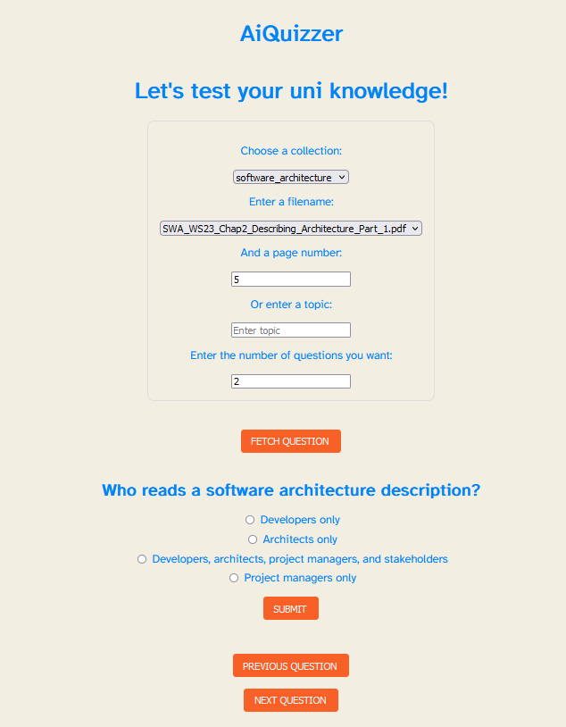

# AiQuizzer
Another ai playground project. Use the OpenAI API to generate multiple choice questions with context from PDF files - stored in [chromadb](https://github.com/chroma-core/chroma) - to test your uni knowledge.



Prompt inspired by [this repo](https://github.com/quentin-mckay/AI-Quiz-Generator). Dockerfile for the frontend taken from [this gist](https://gist.github.com/AradAlvand/04b2cad14b00e5ffe8ec96a3afbb34fb).

## To do
- [ ] Gamification (e.g. points for correct answers, emoji awards for streaks)
- [ ] Error handling (e.g. if no questions are generated)
- [ ] Exclude headers and footers from PDFs (tricky)
- [ ] Add Qualitiy checks in question generation (Multiple API calls? Or use GPT 4?)
- [ ] Refactor backend (Move chromdb and openai logic to separate files)
- [ ] Refactor frontend (Undestand svelte, clean repo, make UI less ugly)
- [ ] Add more question types (e.g. True/False, Fill in the blank)
- [ ] Make docker use Pipfile for backend?

## Local Deployment

### Pre-requisites
- [Docker](https://docs.docker.com/get-docker/)
- [Docker Compose](https://docs.docker.com/compose/install/)
- OpenAI API key

### Setup

1. Clone the repo
2. Create a `.env` file in the `./backend` directory with the following variables:
```
OPENAI_API_KEY=<your key>
TEXT_FILTER=<your filter> e.g. "University of Hanover; Pof. John Smith"
```
3. Create a `docs` directory in the `./backend` of the repo and add your PDF files to it. Example structure:
```
backend
├── docs
│   ├── folder1 # Name of the folders will be used as collection name in chromadb
│   │   ├── file1.pdf
│   │   ├── file2.pdf
│   │   └── file3.pdf
│   └── folder2
│       ├── file1.pdf
│       ├── file2.pdf
```
4. Run the following command in the root directory of the repo:
```
docker-compose up -d -f docker-compose.yml
```


## Development

### Backend

```
cd backend
pipenv install
pipenv shell
python app.py
```

### Frontend
```
cd frontend
npm install
npm run dev
```